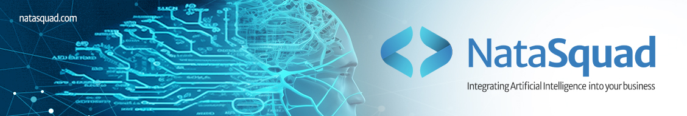

# Bienvenidos al Hackathon de IA de NataSquad

## Introducción

NataSquad (natasquad.com) es una empresa de origen francés pionera en el desarrollo de soluciones empresariales con Inteligencia Artificial. Nos complace anunciar nuestro primer Hackathon de Inteligencia Artificial, exclusivamente diseñado para jóvenes cubanos graduados en carreras técnicas, como ciencias de la computación, ingeniería de software y otras áreas relacionadas. Nuestro objetivo principal es identificar y atraer talentos prometedores para ofrecerles una oportunidad laboral en NataSquad. Estamos en busca de formar un equipo de trabajo multidisciplinario capaz de resolver problemas y crear productos en IA generativa, Machine Learning y Data Science.

## Sobre el Evento

El evento consta de 4 problemas de Machine Learning y 3 problemas de IA generativa. Los participantes tienen total libertad para elegir el campo en el que más les interesaría trabajar con nosotros y seleccionar el problema que prefieran dentro de ese campo. No es necesario alcanzar los primeros lugares para conseguir la oportunidad laboral, ya que buscamos formar un equipo más grande. Después del hackathon, todos los participantes que hayan resuelto uno de los problemas cumpliendo todos los requisitos y siguiendo buenas prácticas podrán enviar sus CV y participar en una entrevista.

Los problemas están diseñados para ser resueltos en un período de 2 semanas trabajando 2 horas diarias. Los participantes deben tener en cuenta que la evaluación para el ranking del hackathon será por UN SOLO PROBLEMA, el cual deben especificar, en la sección de Modelo de participacion se explicará cómo. No obstante, para la etapa posterior de entrevistas pueden preparar más problemas e incluso en ambos campos de IA generativa y Machine Learning.

## Beneficios

Los beneficios para los participantes son muchos. En primer lugar, el impacto para sus carreras y CV, ya que estarán participando en un evento de carácter nacional auspiciado por una empresa extranjera. Tendrán la oportunidad de resolver problemas reales que tienen un impacto real en empresas y negocios de todo el mundo a día de hoy. La competencia por las carreras de IA está en auge y, sobre todo desde Cuba, es un camino profesional bastante difícil debido a la escasez de oportunidades. Ahora, los concursantes tienen la posibilidad de participar en un evento exclusivamente hecho para cubanos y, posteriormente, trabajar con una empresa francesa en desarrollo de IA, independientemente de su nivel de senioridad.

## Premios

Además de la invaluable oportunidad de crecimiento profesional y laboral, también ofrecemos premios tangibles a los ganadores del hackathon:

•	Primer lugar: Un viaje a Francia con todos los gastos pagados durante 30 a 60 días.

•	Segundo lugar: Una nueva laptop.

•	Tercer lugar: Un smartphone nuevo.

Esperamos ver tu participación en este emocionante evento. ¡Buena suerte a todos los concursantes!

## Modelo de participación.

El repositorio consta de dos carpetas en donde están los problemas de Machine Learning e IA Generativa respectivamente. Cada problema tiene su carpeta dedicada en donde podrán encontrar información introductoria sobre cada uno. En la fecha marcada para el inicio del evento se actualizará el repositorio con toda la información de cada problema y los juegos de datos en los casos que sean necesarios. 
El método de participación es levantando una Issue en el repositorio del evento. 

#### MUY IMPORTANTE

La Issue debe tener la estructura que se dará a continuación, de no seguir la estructura no se tendrá en cuenta la participación puesto que es de vital importancia para la organización.

### Estructura:

Título: {Nombre} {1er Apellido} Problema {#} {Nombre del problema} (todo espaciado).

Cuerpo: Nombre completo, correo, número de teléfono, link del repositorio propio con la respuesta. Cualquier información adicional o de contacto que estimen conveniente.

### Los problemas son: 

1 Customer Churn

2 Time Series Forecasting

3 Customer Segmentation

4 Fraud Detection

5 Summarizing with LLM

6 QR Code Design

7 Customized Event Flyers

### Ejemplo:

Título:  Reynold Oramas Problema 1 Customer Churn.

Cuerpo:

Ejemplo de Issue.

Autor: Reynold Alejandro Oramas Rodríguez

Correo: ai.hackathon@natasquad.com

Número de teléfono: ********

Repositorio de solución: https://github.com/Reynold97/NataSquad-AI-Hackathon.git.

Se debe tener en cuenta que las Issue se verán de manera pública, por lo que se recomienda esperar hasta el último día para hacer la entrega de las respuestas. 

## Reglas:

•	Lenguaje de programación: Python.

•	El objetivo del evento es captar talentos que quieran formar parte de nuestro equipo de trabajo, pero no es un requisito para participar y no va a influir en los resultados finales. Sin embargo, los premios si se entregarán a los mejores concursantes que posteriormente se nos vayan a unir. 

•	Cada concursante solamente puede levantar una Issue con el problema que desea participar en el concurso. La solución de problemas adicionales se revisaría en la etapa de entrevistas personales si desean optar por una oportunidad laboral con nosotros. 

•	El repositorio de respuesta debe contener un archivo README.md donde pueden dar la información que requieran, un archivo requirements.txt con todos los paquetes necesarios para correr la solución y un jupyter notebook con la solución al problema.

•	Para la solución de problemas de IA Generativa se les compartirá a los participantes una llave de OpenAI o de Stable Diffusion la cual deben solicitar escribiendo al correo del evento ai.hackathon@natasquad.com. IMPORTANTE, las llaves son únicas y no deben ser expuestas de manera pública o se invalidarán.  MUY IMPORTANTE, aunque cada participante tendrá una llave única, serán de una cuenta compartida que contará con fondos razonables pero limitados, por tanto, es necesario apelar a la responsabilidad colectiva y que estos recursos solamente se utilicen para su investigación y no para cargas de trabajo de mayor volumen. Las llaves se liberarán el día que comience el evento. 

•	Este hackathon de IA es un evento multidisciplinario, pero comparte un mismo ranking. Primeramente, se escogerá el mejor trabajo de cada problema y luego se conformará el ranking final, pensamos que es la forma más equitativa y motiva la participación en todos los campos. 

•	El comité de evaluación se reserva el derecho de suspender la participación de cualquier concursante por cuestiones que consideren pertinentes, sin reclamación.

## Criterios de evaluación.

Los criterios de evaluación en orden de importancia son:

•	Storytelling: La comunicación y presentación de resultados es una de las habilidades blandas más importantes para los profesionales en el campo de la IA y la Ciencia de Datos. Los participantes deben comentar todo su proceso de pensamiento durante la solución del problema y sacar conclusiones parciales de sus pasos, ninguna parte del proceso de solución debe quedar sujeta al entendimiento del evaluador. Las soluciones propuestas deben poder leerse como un buen libro, pero conciso y con puntos claros. Los concursantes tienen libertad y se les motiva a utilizar gráficas, imágenes, referencias, etc, siempre que sirvan a un propósito.  

•	Código limpio: Mantener bien estructurado y comentado el código de la solución.

•	Buenas prácticas: Todos los problemas, en especial los de Machine Learning que son problemas clásicos del campo, tienen características, métodos, “do’s & don’ts” que deben ser respetados.

•	Comparación de resultados: Comparación del rendimiento de los modelos en los problemas de Machine Learning y la calidad de las respuestas en los problemas de IA Generativa.

## Contacto

Si tienes alguna pregunta o necesitas más información, no dudes en contactarnos.

Correo: ai.hackathon@natasquad.com

Grupo de Telegram: https://t.me/hackathonparacubanos

## Conclusión

Este es un evento único y una gran oportunidad para impulsar tu carrera en IA. Esperamos tu participación y estamos emocionados de ver las soluciones innovadoras que puedes aportar a nuestros desafíos. ¡Buena suerte a todos los participantes!

## Créditos

### Organización y Evaluación 

https://github.com/Reynold97

https://github.com/lasan90

### Evaluación

https://github.com/rolysr

https://github.com/malayibiri

